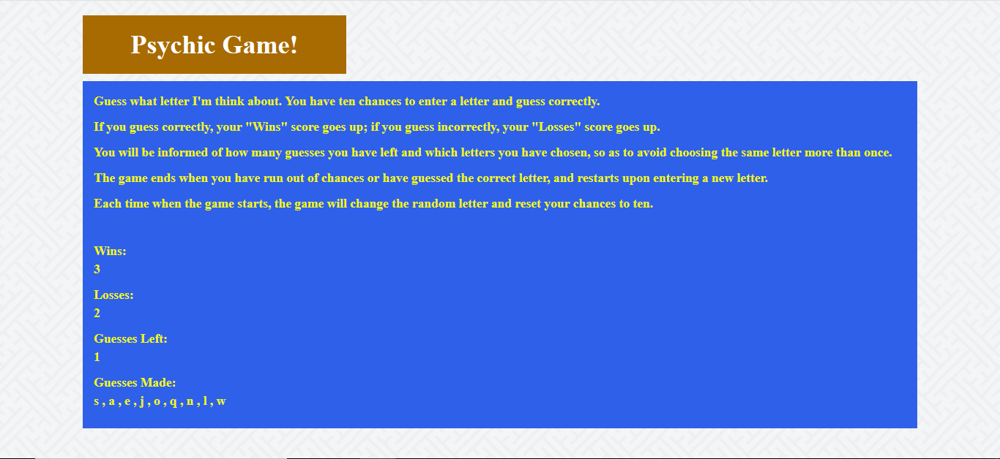

# Psychic-Game

A JavaScript-based game in which the user is tasked with guessing a random letter.

## How to Use

User opens the game via this GitHub Pages [link](https://wespres1990.github.io/Psychic-Game/).

The game is started when the user presses any letter key, and the letter will be displayed as a guessed letter. There are ten chances for the user to guess the correct letter generated by the computer and each attempt will be displayed, so that the user does not risk attempting a letter that has already been used.

If the user correctly guesses the random letter, the win count will add up by one; otherwise, if the user fails to do so after all available attempts, the lose count will add up by one. At the conclusion of either of these scenarios, the game automatically resets itself with a fresh set of chances to guess a new random letter.

### Technologies Used

Languages - HTML5, CSS4, JavaScript

Libraries - Bootstrap

Text Editor - Visual Studio Code

## Preview

### Game in Progress
- - - -

## Contributing

Please feel free to branch off with tweaks and making a repo; open to suggestions for improvement!

## Future Development

* Expand the game to include numbers, so that users will have to guess a randomly-generated number or letter.

## Authors

* **Wesley Hutchins** - [Github](https://github.com/WesPres1990)